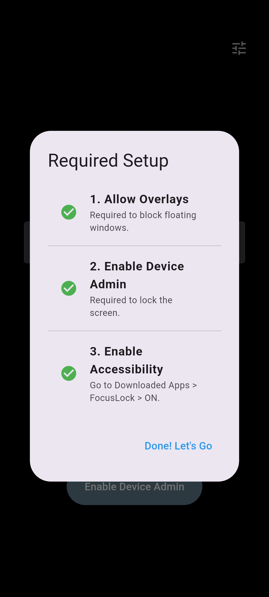
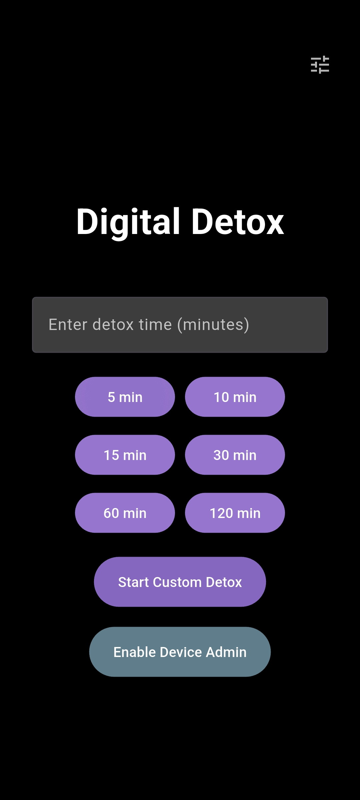
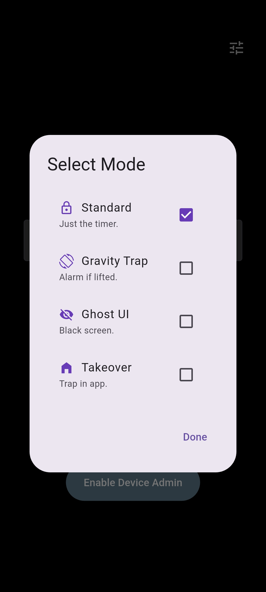

# FocusLock 🛡️📵

> **The Unescapable Digital Detox Solution**

[](FocusLock.apk)

FocusLock is a high-security productivity application engineered to enforce genuine digital disconnects. Unlike standard blocking apps that are easily bypassed via task managers or system gestures, FocusLock leverages low-level Android APIs and a specialized hybrid architecture to ensure total compliance during detox sessions.

## 📸 Functionality Gallery
| Setup Checklist | Detox Timer | Penalty Modes | Lock Screen |
|:---:|:---:|:---:|:---:|
|  |  |  |  |
| *Ensures Permissions* | *Set your goal* | *Choose your trap* | *No Escape* |

---

## 🚀 Features

### 1. Hybrid Native-Dart Architecture
FocusLock bridges the elegant UI capabilities of **Flutter (Dart 3.x)** with the deep system-level enforcement of **Android (Kotlin)**. High-frequency communication via a custom Flutter `MethodChannel` (`com.example.focuslock/detox`) enables low-latency coordination with Android's underlying window, audio, and device policy infrastructure.

### 2. Multi-Layered Security "Trap"
To ensure compliance during detox sessions, FocusLock implements a multi-layered, defense-in-depth security model:
*   **System Alert Window Overlay**: A `TYPE_APPLICATION_OVERLAY` blocking view is injected directly into the Android `WindowManager` stack. If the user attempts to exit via floating windows, split-screen mode, or picture-in-picture, the app instantly occludes the screen and prompts them to return.
*   **System gesture & Touch Interception**: A custom **Accessibility Service** (`FocusLockAccessibilityService`) runs at the system level to capture and discard specific physical inputs (`KEYCODE_BACK`, `KEYCODE_HOME`, `KEYCODE_APP_SWITCH`).
*   **Gesture Exclusion Rects**: The app programmatically sets `systemGestureExclusionRects` to bypass Android 10+ swipe-based navigation (left, right, top, and bottom edge swipes).
*   **System Swipe Detection & Gesture Trap**: FocusLock uses interactive pointers (`onPointerCancel` listener) to detect when the operating system steals touch events (typically during home/recents gesture swipes), triggering an immediate audio alarm penalty.

### 3. Hardware-Level Volume Guardian
To prevent users from simply muting or silencing their devices to ignore alarms:
*   **Audio Focus & Volume Seizure**: The application programmatically locks the system `STREAM_MUSIC` stream to its logical maximum on every tick of the countdown.
*   **Volume Key Consumption**: The native accessibility service listens for `KEYCODE_VOLUME_DOWN` and `KEYCODE_VOLUME_MUTE` and consumes these events, making physical hardware buttons inert.

### 4. Admin-Level Kiosk Mode
FocusLock leverages Android's **Device Policy Manager** to execute `startLockTask()`. 
*   **Standard Pinning**: By default, this puts the device into a pinned state, suppressing the Status Bar, Notification Shade, and Home/Recents indicators.
*   **Un-Bypassable Kiosk Mode**: When provisioned as a **Device Owner**, the app whitelists itself via `setLockTaskPackages()`, yielding a highly secure, enterprise-grade lock state that completely disables native system gestures and overlays.

### 5. Multi-Mode Detox Customization
Users can customize their session rules with tailored modes configured in the settings dashboard:
*   **Standard Mode**: Classic full-screen countdown with active overlay guarding and accessibility enforcers.
*   **Gravity Trap Mode**: Leverages `sensors_plus` to monitor accelerometer forces. If the device's absolute Z-axis acceleration deviates from a strict flat plane ($|Z| \le 9.75$, approx. $5^\circ$ tilt), a looping, high-intensity alert (`gravity_sound.mp3`) triggers and ceases only when placed flat.
*   **Ghost UI Mode**: Renders a completely black, non-responsive screen to simulate a powered-off or dead device. Tapping anywhere shows a brief, flashing red `"SYSTEM LOCKED"` warning for 2 seconds before fading.
*   **Takeover Mode (Kiosk / Launcher)**: Re-routes home intents to lock the user within the active countdown screen, sealing exit channels.

### 6. Emergency Escape Loophole (Bypass Hatch)
To prevent accidental permanent lockouts or soft-bricks during development and testing, a hidden debug mechanism is built-in:
*   **The Escape Gesture**: Continuous long-pressing on the central countdown timer (or the center of the screen in Ghost mode) for **10 consecutive seconds** activates an emergency release, cleanly terminating the lock task and unlocking the system.

---

## 🛠️ Technical Architecture & Stack

*   **Frontend UI Engine**: Flutter (Dart 3.9.2) utilizing Material 3 design systems, asynchronous state handling via the `ListenableBuilder` and `ChangeNotifier` pattern, and custom canvas particle animations (`ParticlePainter`).
*   **Native Enforcer Layer**: Kotlin (Android Native API level 21+) implementing custom accessibility services (`FocusLockAccessibilityService`) and active Device Admin Broadcasters (`FocusLockDeviceAdminReceiver`).
*   **State Synchronization**: Flutter's `shared_preferences` database handles local storage, sharing active lock flags with native background threads using standard key namespaces (e.g., `flutter.isLocked`).
*   **Sensors & Keep-Alive**: `sensors_plus` for real-time accelerometer polling and `wakelock_plus` to override OS screen-sleep limits.
*   **Audio Pipeline**: `audioplayers` for loop-based background alarm and success state playback.

---

## 🔐 Required Permissions
FocusLock requires elevated permissions to hook into system-level operations. A built-in **Setup Checklist Dialogue** guides users through the activation flow prior to commencing any session:
1.  **Display Over Other Apps (`SYSTEM_ALERT_WINDOW`)**: Renders the blocking overlay to secure split-screen and multi-window environments.
2.  **Device Administrator (`BIND_DEVICE_ADMIN`)**: Elevates permissions to permit screen pinning via `DevicePolicyManager`.
3.  **Accessibility Service (`BIND_ACCESSIBILITY_SERVICE`)**: Grants the permission necessary to intercept hardware keys (volume down, mute) and swipe gestures.

---

## 📂 Project Structure

```
├── android/app/src/main/kotlin/com/example/focuslock/
│   ├── MainActivity.kt                      # Orchestrates MethodChannels, Overlay Views, and Gesture Rects
│   ├── FocusLockAccessibilityService.kt      # Consumes hardware keys and blocks system dialogs/notification shades
│   └── FocusLockDeviceAdminReceiver.kt      # Listens to Device Administrator callback events
├── assets/
│   ├── alarm_sound.mp3                      # Audio feedback played upon successful session completion
│   ├── gravity_sound.mp3                    # Alarm audio played when Gravity Trap triggers
│   └── premium_dark_focus_background.png
├── lib/
│   ├── main.dart                            # Application entry point & configuration setup
│   ├── screens/
│   │   ├── timer_screen.dart                # Preset selectors, custom timer config, permission setup dialog
│   │   └── lock_screen.dart                 # Secure lock interface, touch listener traps, loophole state machine
│   ├── services/
│   │   └── detox_service.dart               # Core Dart state manager, audio triggers, sensor listener bridges
│   └── widgets/
│       └── particle_painter.dart            # Custom canvas particle animation background
├── pubspec.yaml                             # Project metadata, dependencies, and asset registration
└── readme.md                                # Project documentation
```

---

## ⚡ Installation & Deployment

### 1. Prerequisites
*   Flutter SDK (`^3.9.2`)
*   Android SDK (API level 21 or higher)
*   A physical Android device with Developer Options & USB Debugging enabled. *(Note: High-level accessibility hooks, volume key interception, and screen overlays cannot be fully verified inside standard Android Emulators).*

### 2. Standard Setup
```bash
# 1. Clone the repository
git clone https://github.com/Priyanshu-x/focuslock.git
cd focuslock

# 2. Retrieve Flutter dependencies
flutter pub get

# 3. Compile and launch on your connected device (Release mode highly recommended for complete Native API execution)
flutter run --release
```

### 3. Provisioning Strict Kiosk Mode (Optional)
To achieve complete, un-bypassable lockout (where home and recent tasks gestures are natively blocked by the Android OS), provision FocusLock as the device owner using the Android Debug Bridge (ADB) prior to initiating your first session:
```bash
adb shell dpm set-device-owner com.example.focuslock/.FocusLockDeviceAdminReceiver
```

---

## ⚠️ Security Disclaimer & Development Warning
FocusLock leverages powerful Android system hooks designed for enterprise management. **Do not remove or alter the 10-second long-press escape loophole during development.** Modifying this behavior on a physical device without ADB debugging enabled could cause a soft-brick, necessitating a factory reset of the host device. Use this application responsibly.
